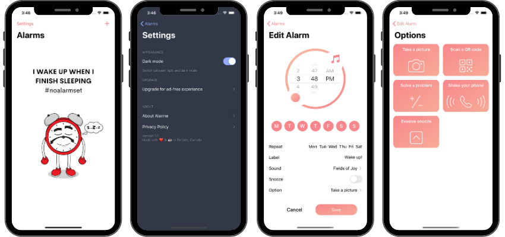

## About the app

### Alarme

Alarme is just another iOS alarm application with an option to snooze the alarm, or if you are more hard-core do something to earn turning it off.

### You Snooze, You Lose

The main feature of Alarme is the option to turn the Snooze button off and instead of snoozing the alarm, user is presented with 5 different options to turn the alarm off once it goes off.

|      | Options to Turn Off the alarm     |
|---                  |---   |
| Take a picture                   | Take a picture of any object when setting the alarm. Once the alarm goes off, user can turn the alarm off only by taking a picture of the same object.  |
| Scan a QR code                  | Scan a QR code when setting the alarm. Once the alarm goes off, scan the same QR code to turn it off. |
| Solve a problem                     | Solve a mathematical problem to turn the alarm off. |
| Shake your phone               | Shake your phone designated number of times to turn the alarm off. |
| Evasive button                     | Simply press a turn-off button with your finger, but first try to catch it while it's jumping on your screen from one point to another, randomly. |

## Concepts used

* MVC Design Pattern
* In-app dark mode switch with UserDefaults
* Privacy Policy view using WebKit

---

### TO-DO:

- [ ] Find a solution to present the alarm to the user (push notifications?) while it's running in the background
- [ ] Write an About Alarme section

* Implement: 

- [x] sounds for the alarm
- [ ] options to turn-off the alarm
- [ ] core data for data persistance
- [ ] privacy-policy
- [ ] adds
- [ ] in-app purchase

 
 

>This is a learning project created by implementing different Swift components. Check my portfolio at [danijelavrzan.com](https://danijelavrzan.com).

 
   

